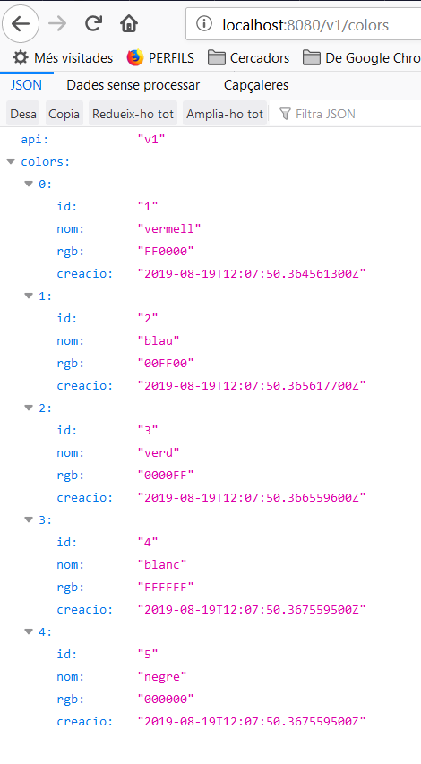
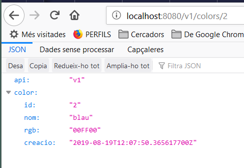

# Servidor de colors gRPC

Creació d'un servei [gRPC](https://grpc.io/) que permeti mantenir una llista de colors/rgb. Per tant tindrà les operacions de crear, recuperar, modificar i esborrar colors del servei.

He optat per no fer servir cap sistema de base de dades per mantenir-lo el màxim de senzill possible

## Executar el servidor

El main del servidor es troba a `cmd/server`:

```bash
cd cmd/server
go build .
```

El servidor s'executa especificant quin port volem fer servir:

```bash
./server -grpc-port=9090 -http-port=8080
```

Si tot ha anat bé sortirà un missatge com aquest:

```text
2019/08/20 15:29:51 iniciant el gateway HTTP...
2019/08/20 15:29:51 Iniciat el servidor gRPC ...
```

Ara s'hauria de poder accedir al servei via gRPC i a través de connexió HTTP (ex. http://localhost:8080/v1/colors)

| Verb   | URL path        | Efecte                                 |
| ------ | --------------- | -------------------------------------- |
| GET    | /v1/colors      | Recupera tots els colors               |
| GET    | /v1/colors/{id} | Recupera el color amb l'id especificat |
| POST   | /v1/colors      | Crea un color nou                      |
| PUT    | /v1/colors/{id} | Modifica el color amb l'id especificat |
| DELETE | /v1/colors/{id} | Esborra el color amb l'id especificat  |

Exemples amb HTTPIE:

```bash
$ http GET http://localhost:8080/v1/colors/3
HTTP/1.1 200 OK
Content-Length: 102
Content-Type: application/json
Date: Tue, 20 Aug 2019 13:38:06 GMT
Grpc-Metadata-Content-Type: application/grpc

{
    "api": "v1",
    "color": {
        "creacio": "2019-08-20T13:32:32.292490057Z",
        "id": "3",
        "nom": "verd",
        "rgb": "0000FF"
    }
}

$ http DELETE http://localhost:8080/v1/colors/3
HTTP/1.1 200 OK
Content-Length: 26
Content-Type: application/json
Date: Tue, 20 Aug 2019 13:38:25 GMT
Grpc-Metadata-Content-Type: application/grpc

{
    "api": "v1",
    "deleted": "1"
}

$ http PUT http://localhost:8080/v1/colors/1 api="v1" color:='{"nom":"rosa", "rgb":"ff0080"}'
HTTP/1.1 200 OK
Content-Length: 26
Content-Type: application/json
Date: Tue, 20 Aug 2019 14:32:03 GMT
Grpc-Metadata-Content-Type: application/grpc

{
    "api": "v1",
    "updated": "1"
}

$ http GET http://localhost:8080/v1/colors/1
HTTP/1.1 200 OK
Content-Length: 102
Content-Type: application/json
Date: Tue, 20 Aug 2019 14:32:07 GMT
Grpc-Metadata-Content-Type: application/grpc

{
    "api": "v1",
    "color": {
        "creacio": "2019-08-20T14:27:02.570703861Z",
        "id": "1",
        "nom": "rosa",
        "rgb": "ff0080"
    }
}

$ http POST http://localhost:8080/v1/colors api="v1" color:='{"nom":"groc", "rgb":"FFFF00"}'
HTTP/1.1 200 OK
Content-Length: 21
Content-Type: application/json
Date: Tue, 20 Aug 2019 14:35:52 GMT
Grpc-Metadata-Content-Type: application/grpc

{
    "api": "v1",
    "id": "7"
}
```

He vist que en les versions GET no cal especificar la versió de API, però a l'hora de fer canvis si. No sé si és algun problema amb la meva implementació

## Executar el client

Per ara el client és una mica rudimentari i només funciona amb gRPC. Només crea el color vermell i el blau, recupera el que tingui Id=2, i recupera tots els colors del servidor ...

```bash
cd cmd/client
./client -servidor="localhost:9090"
```

Ara comprova que els colors no siguin repetits o sigui que només es pot executar una vegada :-(

El resultat serà:

```text
PS E:\work-random\programming\golang\grpccolors\cmd\client> .\client.exe -servidor="localhost:9090"
2019/08/18 18:12:32 Create: <api:"v1" id:1 >

2019/08/18 18:12:32 Read: <api:"v1" color:<id:1 nom:"Vermell" rgb:"FF0000" creacio:<seconds:1566144752 nanos:4133600 > > >

2019/08/18 18:12:32 ReadAll: <api:"v1" >
2019/08/18 18:15:26 Resultat: <api:"v1" color:<id:1 nom:"Vermell" rgb:"FF0000" creacio:<seconds:1566144926 nanos:560139900 > > >
```

## Modificar el servidor

Per poder-lo compilar/modificar cal:

- El compilador de Go instal·lat
- El compilador de [protocolbuffers](https://github.com/protocolbuffers/protobuf/releases)


En realitat només cal que l'executable estigui dins del PATH perquè la resta la tinc inclosa a `third_party`

## Creació del servidor

El primer és descarregar la dependència més important, el plugin de Go per Protoc:

```bash
go get -u github.com/golang/protobuf/protoc-gen-go
```

### Definició del protocol

El primer és definir les operacions, el format dels missatges, etc.. en format protocolbuffers. Es troba a `api/proto/v1/colors-service.proto`

Si es modifica s'ha d'executar de nou la generació automàtica de codi:

```bash
third_party/protoc-gen.sh
```

O el que és el mateix executar `protoc` amb el camí a la definició i el lloc on s'ha de generar el codi (en aquest cas a pkg):

```bash
protoc --proto_path=api/proto/v1 --proto_path=third_party --go_out=plugins=grpc:pkg/api/v1 colors-service.proto
```

Això regenerarà el fitxer `colors-service.pb.go`

### Crear el codi del servei

En la carpeta `service/v1` es defineixen les operacions del servei. En aquest cas el servei fa servir una llista per emmagatzemar/recuperar els colors que se li han passat i un número per generar els IDs.

Sobreescric el servidor autogenerat per posar-li més dades i li implemento les operacions

```golang
type colorServiceServer struct {
    lastID       int64
    llistaColors []v1.Color
}
```

Hi ha una operació per crear el servei `NewColorServiceServer`, algun helper i les operacions definides per l'API

### Crear l'arrencada del servidor

A `pkg/protocol/grpc/server.go` es defineix el codi que servirà per iniciar i aturar el servidor. Tot es fa en el mètode `RunServer`

### Configuració del servidor per línia de comandes

El `server.go` de `pkg/cmd/server/server.go` és per poder passar paràmetres al servidor des de la linia de comandes (es podria fer servir per obtenir un sistema d'emmagatzematge de dades, etc... )

## Afegir un endpoint REST

gRPC es pot fer servir conjuntament amb REST. Per això s'ha creat el grpc-gateway que filtra les peticions i les pot convertir en HTTP.

Per fer-ho cal fer algunes modificacions en el codi i instal·lar paquets nous:

```bash
go get -u github.com/grpc-ecosystem/grpc-gateway/protoc-gen-grpc-gateway
go get -u github.com/grpc-ecosystem/grpc-gateway/protoc-gen-swagger
go get -u github.com/golang/protobuf/protoc-gen-go
```

Al treballar amb mòduls he de copiar el contingut de _%GOPATH%/src/github.com/grpc-ecosystem/grpc-gateway/third_party/googleapis/google_ a la carpeta _third_party/google_.

Si es vol treballar amb Swagger (encara no ho he fet també caldria afegir el contingut de _%GOPATH%/src/github.com/grpc-ecosystem/grpc-gateway/protoc-gen-swagger/options_ a _third_party\protoc-gen-swagger/options_ (però aquí no està fet perquè també caldria definir Swagger en la definició de l'arxiu **proto** i no vull complicar-ho més)

Després en la definició del protocol s'hi ha d'importar les anotacions i la opció `google.api.http` per cada una de les peticions accessibles per REST:

```protobuffer3
syntax = "proto3";

package v1;

import "google/protobuf/timestamp.proto";
import "google/api/annotations.proto";
```

i en els mètodes:

```protobuffer
service ColorService {
    // Create new todo task
    rpc Create(CreateRequest) returns (CreateResponse) {
        option(google.api.http) = {
            post: "/v1/colors"
            body: "*"
        };
    };
    etc...
```

També s'ha de canviar la generació de codi del fitxers `protoc-gen.sh` i `protoc-gen.cmd` perquè a més generin les dades REST

```bash
protoc --proto_path=api/proto/v1 --proto_path=third_party --go_out=plugins=grpc:pkg/api/v1 colors-service.proto
protoc --proto_path=api/proto/v1 --proto_path=third_party --grpc-gateway_out=logtostderr=true:pkg/api/v1 colors-service.proto
protoc --proto_path=api/proto/v1 --proto_path=third_party --swagger_out=logtostderr=true:api/swagger/v1 colors-service.proto
```

Ara en comptes de crear un sol stub en crearà dos:

```text
colors-service.pb.go
colors-service.pb.gw.go
```

Es defineix com s'ha d'iniciar el gateway HTTP d'una forma similar a com ho feia el servidor gRPC: `pkg/protocol/rest/server.go`

I se li ha de dir al procés d'iniciar el servei que l'engegui: `pkg/cmd/server.go`

Ara després de compilar el servidor iniciarà els dos serveis, el gRPC i el REST:




