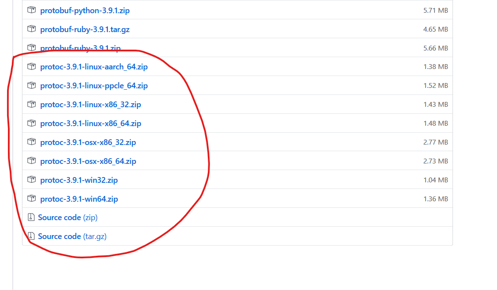

# Servidor de colors gRPC

Creació d'un servei [gRPC](https://grpc.io/) que permeti mantenir una llista de colors/rgb. Per tant tindrà les operacions de crear, recuperar, modificar i esborrar colors del servei.

He optat per no fer servir cap sistema de base de dades per mantenir-lo el màxim de senzill possible

## Executar el servidor

El main del servidor es troba a `cmd/server`:

```bash
cd cmd/server
go build .
```

El servidor s'executa especificant quin port volem fer servir:

```bash
./server -grpc-port=9090
```

Si tot ha anat bé sortirà un missatge com aquest:

```text
2019/08/18 18:12:25 Iniciat el servidor gRPC ...
```

## Executar el client

Per ara el client és una mica rudimentari i només crea uns quants colors, recupera el que tingui Id=2, i llista tots els 
colors del servidor ...

```bash
cd cmd/client
./client -servidor="localhost:9090"
```

El resultat serà:

```text
$ .\client -servidor="localhost:9090"
2019/08/20 17:22:51 Create: Id=1

2019/08/20 17:22:51 Create: Id=2

2019/08/20 17:22:51 Create: Id=3

2019/08/20 17:22:51 Create: Id=4

2019/08/20 17:22:51 Create: Id=5

2019/08/20 17:22:51 Read: 2, blau, 00FF00

2019/08/20 17:22:51 ----- COLORS ----
2019/08/20 17:22:51 Color: 1 vermell : FF0000
2019/08/20 17:22:51 Color: 2 blau : 00FF00
2019/08/20 17:22:51 Color: 3 verd : 0000FF
2019/08/20 17:22:51 Color: 4 blanc : FFFFFF
2019/08/20 17:22:51 Color: 5 negre : 000000
```

## Modificar el servidor

Per poder-lo compilar/modificar cal:

- El compilador de Go instal·lat
- El compilador de [protocolbuffers](https://github.com/protocolbuffers/protobuf/releases)



En realitat només cal que l'executable estigui dins del PATH perquè la resta la tinc inclosa a `third_party`

## Creació del servidor

El primer és descarregar la dependència més important, el plugin de Go per Protoc:

```bash
go get -u github.com/golang/protobuf/protoc-gen-go
```

### Definició del protocol

El primer és definir les operacions, el format dels missatges, etc.. en format protocolbuffers. Es troba a `api/proto/v1/colors-service.proto`

Si es modifica s'ha d'executar de nou la generació automàtica de codi:

```bash
third_party/protoc-gen.sh
```

O el que és el mateix executar `protoc` amb el camí a la definició i el lloc on s'ha de generar el codi (en aquest cas a pkg):

```bash
protoc --proto_path=api/proto/v1 --proto_path=third_party --go_out=plugins=grpc:pkg/api/v1 colors-service.proto
```

Això regenerarà el fitxer `colors-service.pb.go`

### Crear el codi del servei

En la carpeta `service/v1` es defineixen les operacions del servei. En aquest cas el servei fa servir una llista per emmagatzemar/recuperar els colors que se li han passat i un número per generar els IDs.

Sobreescric el servidor autogenerat per posar-li més dades i li implemento les operacions

```golang
type colorServiceServer struct {
    lastID       int64
    llistaColors []v1.Color
}
```

Hi ha una operació per crear el servei `NewColorServiceServer`, algun helper i les operacions definides per l'API

### Crear l'arrencada del servidor

A `pkg/protocol/grpc/server.go` es defineix el codi que servirà per iniciar i aturar el servidor. Tot es fa en el mètode `RunServer`

### Configuració del servidor per línia de comandes

El `server.go` de `pkg/cmd/server/server.go` és per poder passar paràmetres al servidor des de la linia de comandes (es podria fer servir per obtenir un sistema d'emmagatzematge de dades, etc... )
